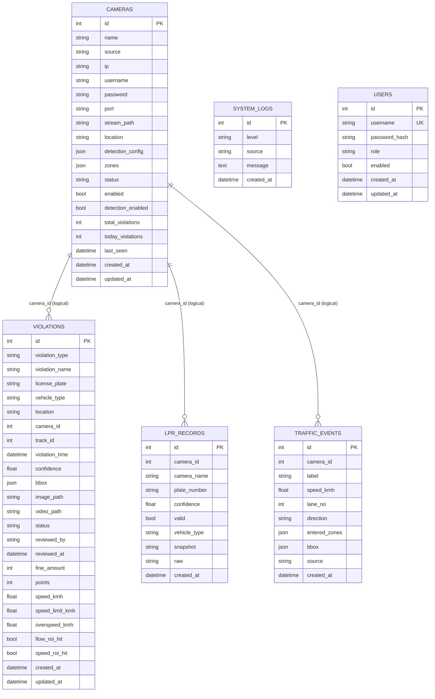

# DB ER Model

資料來源：`api/models.py`（SQLAlchemy ORM）

## ER Diagram

## Tables

## `cameras`
- PK: `id`
- 用途：攝影機主檔、串流參數、ROI/偵測設定
- 關聯：被 `violations.camera_id`、`lpr_records.camera_id`、`traffic_events.camera_id` 參照（邏輯關聯）

## `violations`
- PK: `id`
- 用途：違規事件（含速度與 ROI 命中欄位）
- 重點索引欄位：`violation_type`, `license_plate`, `camera_id`, `violation_time`, `status`

## `lpr_records`
- PK: `id`
- 用途：車牌辨識紀錄
- 重點索引欄位：`camera_id`, `plate_number`, `created_at`

## `traffic_events`
- PK: `id`
- 用途：交通流量事件（車種、速度、車道、方向）
- 重點索引欄位：`camera_id`, `label`, `lane_no`, `direction`, `source`, `created_at`

## `system_logs`
- PK: `id`
- 用途：系統日誌
- 重點索引欄位：`level`, `source`, `created_at`

## `users`
- PK: `id`
- Unique: `username`
- 用途：登入帳號與角色權限

## Notes

- 目前模型未宣告實體 `ForeignKey`；`camera_id` 為應用層維護的邏輯關聯。
- 預設 DB：`sqlite:///./data/violations.db`（可由 `DATABASE_URL` 覆蓋）。
