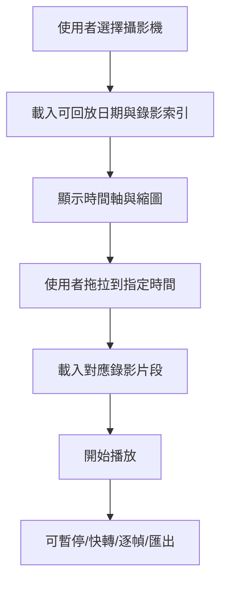
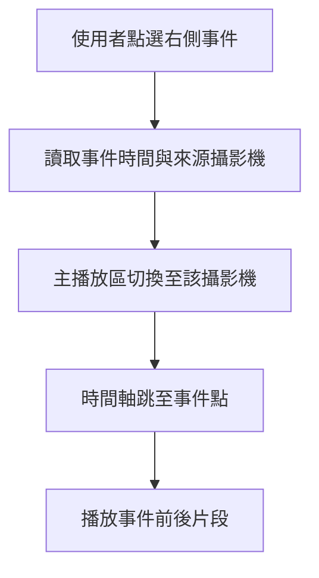

# NVR 錄影回放介面設計專案規格書

## 1. 專案名稱

**NVR 錄影回放介面（Playback UI）設計與開發專案**

---

## 2. 專案目標

建立一套類似圖示介面的 NVR 錄影回放頁面，提供使用者可快速完成：

- 攝影機選取
- 即時 / 錄影畫面切換
- 時間軸拖拉回放
- 事件片段查找
- 多攝影機同步回放
- 告警事件檢視
- 錄影片段匯出
- 快照擷取

本專案的設計方向以「**左側設備樹 + 中央主播放區 + 右側事件/通知面板 + 底部時間軸與縮圖軌道**」為主體。

---

## 3. 設計目標

### 3.1 介面設計目標

1. **操作直覺**
   - 使用者可快速找到攝影機並進入回放。
2. **時間定位快速**
   - 可透過時間軸、縮圖、事件標記快速跳轉。
3. **資訊分區清楚**
   - 左側設備樹、中央播放畫面、右側通知區、底部播放控制清楚分層。
4. **支援多攝影機同步**
   - 適合道路、隧道、路口、廠區等多鏡頭追查情境。
5. **支援事件導向回放**
   - 可從告警、AI 偵測、車牌事件、移動偵測事件直接跳轉。

---

## 4. 主要使用情境

### 4.1 單路攝影機錄影回放
使用者點選指定攝影機後，於主畫面中查看某一時刻錄影內容，並以底部時間軸回放。

### 4.2 多路同步追查
使用者同時開啟多支攝影機，並啟用同步回放，追查同一事件在不同鏡頭的時間序列畫面。

### 4.3 事件導向回放
使用者從右側事件列表點擊某一條告警，系統將主畫面跳轉到該事件發生時間點。

### 4.4 匯出證據片段
使用者在時間軸上框選起訖時間，將錄影片段匯出為檔案，供備查或提報。

---

## 5. 角色定義

### 5.1 管理者
- 管理設備群組
- 設定權限
- 管理回放與匯出功能
- 檢視系統告警與通知

### 5.2 一般操作員
- 瀏覽攝影機清單
- 回放錄影
- 查看事件
- 擷取快照
- 匯出授權範圍內片段

### 5.3 稽核或查證人員
- 依時間或事件查詢錄影
- 匯出錄影片段
- 下載事件證據

---

## 6. 介面配置規格

### 6.1 整體版面結構

```text
┌──────────────────────────────────────────────────────────────┐
│ 頂部工具列 / 導航列                                           │
├──────────────┬───────────────────────────────┬──────────────┤
│ 左側設備樹    │ 中央主播放區                   │ 右側通知/事件 │
│ Camera Tree  │ Playback Canvas               │ Notification  │
│              │                               │ / Event Panel │
├──────────────┴───────────────────────────────┴──────────────┤
│ 底部縮圖軌道 / 時間軸 / 播放控制列                              │
└──────────────────────────────────────────────────────────────┘
```

### 6.2 左側設備樹區（Device Tree）

#### 功能
- 顯示站台、群組、NVR、攝影機清單
- 支援展開 / 收合
- 支援搜尋
- 支援設備狀態顯示
- 支援多台攝影機勾選

#### 顯示內容
- 群組名稱
- NVR 名稱
- Channel 名稱
- 在線/離線狀態
- 告警狀態
- 收藏標記

#### 互動方式
- 單擊：切換主播放畫面
- 雙擊：加入播放視窗
- 右鍵：開啟功能選單（回放、即時、匯出、加入群組等）

### 6.3 中央主播放區（Playback Canvas）

#### 功能
- 顯示主要回放畫面
- 支援單分割與多分割
- 顯示攝影機名稱、時間戳、狀態
- 支援數位縮放
- 支援截圖
- 支援全螢幕
- 支援事件框疊圖（選配）

#### 畫面工具列建議
- 拍照
- 錄影片段匯出
- 放大 / 縮小
- 數位 PTZ
- 同步回放開關
- 回到即時
- 顯示資訊開關
- 關閉視窗

#### 疊圖資訊
- 攝影機名稱
- 錄影時間
- 播放速度
- 回放模式（即時 / 錄影）
- AI 事件標記（若有）

### 6.4 右側通知 / 事件面板（Notification / Event Panel）

#### 功能
- 顯示系統通知
- 顯示事件清單
- 顯示設備異常
- 顯示 AI 偵測事件
- 點擊後跳轉到對應回放時間

#### 建議事件分類
- 攝影機離線
- 錄影異常
- 儲存空間告警
- 動態偵測
- AI 事件（人員、車輛、車牌、闖入、停留等）
- 匯出任務完成通知

#### 事件列表欄位
- 類型
- 時間
- 來源設備
- 等級
- 摘要說明
- 處理狀態

### 6.5 底部時間軸與播放控制列（Timeline & Playback Controls）

#### 核心需求
- 可拖拉時間軸
- 可顯示日期與時間
- 可切換天 / 小時 / 分鐘刻度
- 可顯示錄影存在區段
- 可顯示事件標記
- 可顯示縮圖預覽
- 可顯示目前播放指標

#### 播放控制功能
- 播放 / 暫停
- 上一幀 / 下一幀
- 倍速播放（0.5x / 1x / 2x / 4x / 8x）
- 倒退播放（選配）
- 跳至指定時間
- 同步播放
- 循環播放
- 回到即時

#### 縮圖軌道
- 依時間自動載入縮圖
- 拖拉時間軸時顯示對應縮圖預覽
- 支援快速定位事件附近片段

#### 錄影標示
- 綠色：一般錄影
- 紅色：事件錄影
- 灰色：無錄影
- 黃色：匯出框選區段
- 藍色：使用者書籤

---

## 7. 核心功能需求

### 7.1 播放功能
- 指定攝影機回放
- 播放 / 暫停
- 倍速回放
- 幀播放
- 跳時播放
- 即時切換

### 7.2 時間搜尋
- 依日期選取
- 依時間輸入
- 時間軸拖拉
- 事件點擊跳轉
- 書籤跳轉

### 7.3 多攝影機同步
- 同一時間點同步播放
- 多鏡頭同步暫停 / 播放
- 主控鏡頭時間推動其他鏡頭
- 同步偏移修正（選配）

### 7.4 事件導向回放
- 從事件清單點擊跳至對應時間
- 事件時間附近自動展開縮圖
- 顯示事件前後緩衝片段

### 7.5 快照與匯出
- 單張快照下載
- 指定時間段匯出
- 匯出工作列追蹤
- 匯出進度與通知

### 7.6 書籤功能
- 新增書籤
- 命名書籤
- 書籤列表管理
- 書籤跳轉

---

## 8. 進階功能（選配）

- AI 事件疊圖回放
- 車牌辨識事件快速跳轉
- 人車軌跡聯動
- 多鏡頭事件拼接
- 匯出時自動加浮水印
- 操作稽核紀錄
- 鍵盤快捷鍵控制
- 片段分享連結（具權限控管）

---

## 9. 功能流程

### 9.1 基本回放流程



### 9.2 事件跳轉流程



---

## 10. 前端元件拆分建議

### 10.1 元件清單
- `PlaybackPage`
- `CameraTreePanel`
- `PlaybackCanvas`
- `CanvasToolbar`
- `NotificationPanel`
- `TimelinePanel`
- `ThumbnailTrack`
- `PlaybackControls`
- `ExportDialog`
- `BookmarkDialog`
- `EventList`
- `DateTimePicker`

### 10.2 狀態管理建議
建議集中管理以下狀態：

- 目前選取攝影機
- 目前播放時間
- 播放狀態（播放 / 暫停）
- 播放速度
- 多鏡頭同步狀態
- 事件列表
- 錄影區段索引
- 匯出任務狀態
- 書籤資料

---

## 11. 後端需求

### 11.1 後端功能模組
- 設備清單 API
- 錄影索引 API
- 回放串流 API
- 縮圖 API
- 事件查詢 API
- 書籤 API
- 匯出任務 API
- 使用者權限 API

### 11.2 建議 API 規格

#### 取得攝影機樹
`GET /api/cameras/tree`

#### 取得指定日期錄影區段
`GET /api/playback/segments?cameraId=xxx&date=2026-03-23`

#### 取得縮圖
`GET /api/playback/thumbnail?cameraId=xxx&ts=...`

#### 取得回放串流
`GET /api/playback/stream?cameraId=xxx&start=...&speed=1x`

#### 取得事件清單
`GET /api/events?cameraId=xxx&from=...&to=...`

#### 建立匯出任務
`POST /api/exports`

#### 查詢匯出狀態
`GET /api/exports/{taskId}`

---

## 12. 資料結構建議

### 12.1 錄影區段

```json
{
  "cameraId": "XNP-C7310R",
  "date": "2026-03-23",
  "segments": [
    {
      "startTime": "2026-03-23T09:00:00",
      "endTime": "2026-03-23T09:05:00",
      "type": "continuous"
    },
    {
      "startTime": "2026-03-23T09:10:12",
      "endTime": "2026-03-23T09:10:55",
      "type": "event"
    }
  ]
}
```

### 12.2 事件資料

```json
{
  "eventId": "evt-1001",
  "cameraId": "XNP-C7310R",
  "eventType": "motion",
  "level": "warning",
  "startTime": "2026-03-23T09:10:12",
  "endTime": "2026-03-23T09:10:30",
  "message": "偵測到移動事件",
  "snapshotUrl": "/api/events/evt-1001/snapshot"
}
```

### 12.3 匯出任務

```json
{
  "taskId": "exp-20260323-001",
  "cameraId": "XNP-C7310R",
  "startTime": "2026-03-23T09:10:00",
  "endTime": "2026-03-23T09:12:00",
  "status": "processing",
  "progress": 45,
  "downloadUrl": null
}
```

---

## 13. 權限需求

### 權限分類
- 檢視即時畫面
- 檢視錄影回放
- 查看事件
- 匯出片段
- 下載快照
- 管理書籤
- 管理設備
- 管理通知與告警

### 控制原則
- 匯出須可限制角色
- 敏感攝影機須可限制群組
- 所有匯出與下載須記錄操作日誌

---

## 14. 非功能需求

### 14.1 效能
- 單路回放切換時間：**2 秒內**
- 時間軸拖拉響應：**300 ms 內**
- 縮圖預覽載入：**1 秒內**
- 事件跳轉回放：**2 秒內**

### 14.2 可用性
- 支援深色主題
- 支援 1920x1080 以上解析度
- 支援多螢幕使用
- 操作按鈕需清楚且易於識別

### 14.3 穩定性
- 網路短暫中斷後可重新連線
- 播放失敗時提供錯誤提示與重試
- 時間軸資料異常時需顯示 fallback 狀態

### 14.4 安全性
- 所有回放與匯出操作寫入日誌
- API 須驗證權限
- 匯出檔案可設定有效期限與簽章

---

## 15. UI 設計重點

### 15.1 左側設備樹
- 支援搜尋框
- 支援節點圖示與狀態燈號
- 支援群組收合
- 清楚顯示設備層級關係

### 15.2 主播放區
- 畫面最大化時仍保留必要操作工具
- 顯示時間戳與設備名稱
- 工具按鈕集中於右上角或畫面邊角

### 15.3 右側通知區
- 依告警等級顯示顏色
- 點擊後可直接跳到回放時間
- 支援未讀/已讀狀態

### 15.4 底部時間軸
- 以滑動、縮放方式調整時間精度
- 清楚顯示錄影存在區段
- 支援滑鼠 hover 顯示縮圖預覽
- 支援框選匯出區間

---

## 16. MVP 範圍建議

### 第一階段（MVP）
- 左側設備樹
- 單路攝影機回放
- 底部時間軸
- 播放控制
- 事件列表
- 點擊事件跳轉
- 快照下載

### 第二階段
- 多路同步回放
- 書籤
- 匯出任務管理
- 縮圖軌道
- 同步控制

### 第三階段
- AI 事件聯動
- 多鏡頭關聯追查
- 進階稽核與分享
- 智慧搜尋與篩選

---

## 17. 驗收標準

### 功能驗收
- 可成功選取攝影機並播放錄影
- 可依時間軸拖拉到指定時間
- 可從事件點擊跳轉回放
- 可播放 / 暫停 / 倍速
- 可下載快照
- 可建立匯出任務

### 介面驗收
- 版面分區清楚
- 深色主題一致
- 時間軸清晰可操作
- 事件與通知資訊易讀

### 效能驗收
- 常用操作在要求時間內完成
- 連續操作不出現明顯卡頓
- 回放時間跳轉成功率高

---

## 18. 技術建議

### 前端
- Vue 3 或 React
- 狀態管理：Pinia / Vuex / Zustand / Redux
- 播放元件：HLS / WebRTC / MSE 依後端架構選擇
- Timeline 可使用 Canvas 或自訂虛擬化渲染

### 後端
- Java Spring Boot / Node.js / Python FastAPI 皆可
- 回放索引建議獨立查詢服務
- 匯出任務建議非同步背景處理

### 儲存
- 事件資料庫
- 錄影索引資料
- 書籤資料
- 匯出任務紀錄

---

## 19. 專案輸出成果

本專案建議最終輸出：

1. 需求規格書
2. UI Wireframe
3. 高保真畫面設計稿
4. 前端元件設計文件
5. API 規格文件
6. 測試案例
7. 驗收清單

---

## 20. 一句話總結

本專案將打造一套以「**設備樹 + 主播放區 + 事件面板 + 時間軸**」為核心的 NVR 錄影回放介面，支援單路與多路回放、事件跳轉、縮圖預覽、匯出與操作稽核，適用於道路監控、隧道監控、園區安全與一般安防場景。
