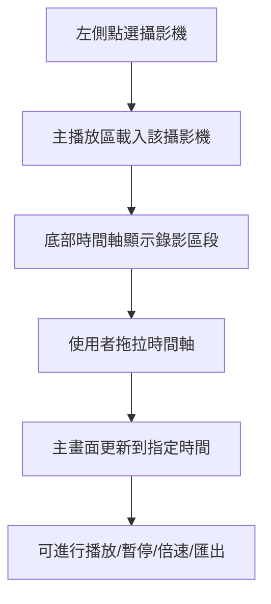
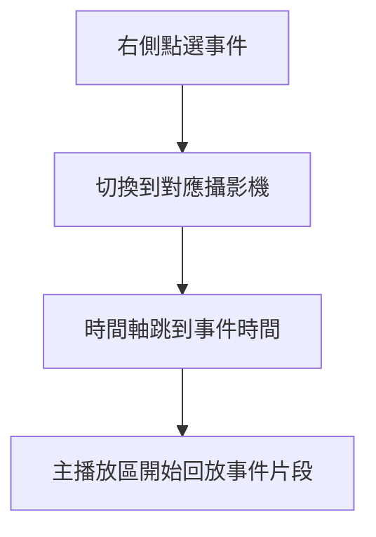
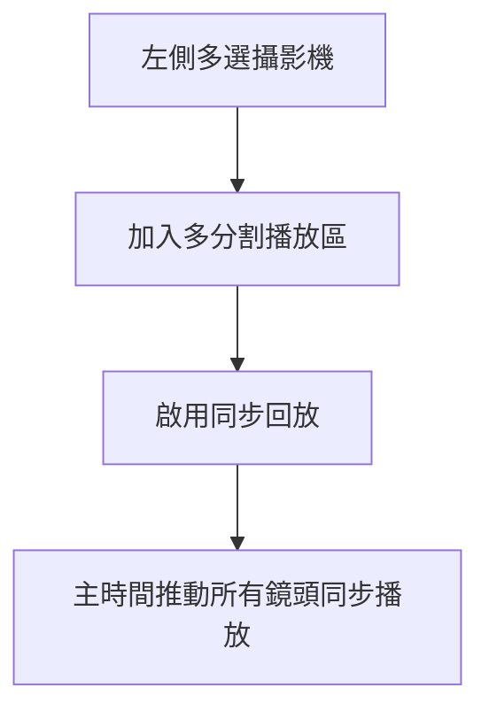

# NVR 錄影回放介面 Wireframe 規格

## 1. 文件目的

本文件用於定義 **NVR 錄影回放介面** 的 Wireframe 結構，作為：

- UI/UX 設計依據
- 前端切版依據
- 後端 API 對接參考
- 專案開發與驗收基準

本 Wireframe 以你提供的介面風格為基礎，採用：

- **深色主題**
- **左側設備樹**
- **中央主播放區**
- **右側通知 / 事件面板**
- **底部時間軸 / 縮圖軌道 / 播放控制列**

---

# 2. 整體畫面架構

```text
┌──────────────────────────────────────────────────────────────────────────────┐
│ Top Header / Navigation                                                     │
├───────────────┬──────────────────────────────────────────────┬──────────────┤
│ Left Sidebar  │ Main Playback Area                           │ Right Panel  │
│ Device Tree   │                                              │ Notifications│
│               │                                              │ / Events     │
├───────────────┴──────────────────────────────────────────────┴──────────────┤
│ Thumbnail Timeline Track                                                    │
├──────────────────────────────────────────────────────────────────────────────┤
│ Main Timeline + Playback Controls                                           │
└──────────────────────────────────────────────────────────────────────────────┘
```

---

# 3. 主要版面區塊

## 3.1 頂部區（Top Header）

### 功能定位
提供全域導覽與系統狀態操作。

### 建議內容
- 系統 Logo / 名稱
- 搜尋欄
- 使用者名稱 / 帳號
- 通知鈴鐺
- 書籤 / 收藏
- 全螢幕按鈕
- 系統設定入口

### Wireframe

```text
┌──────────────────────────────────────────────────────────────────────────────┐
│ [Logo] [搜尋框.........................]                 [通知] [帳號] [設定] │
└──────────────────────────────────────────────────────────────────────────────┘
```

### 設計重點
- 搜尋框固定在左上或中上位置
- 通知、帳號、設定靠右排列
- 深色背景搭配高對比圖示

---

## 3.2 左側設備樹（Left Sidebar / Device Tree）

### 功能定位
顯示站台、NVR、攝影機、Channel 層級，供使用者選擇回放來源。

### 建議元件
- 搜尋欄
- 群組節點
- NVR 節點
- Camera / Channel 節點
- 在線 / 離線狀態點
- 告警圖示
- 收藏圖示

### Wireframe

```text
┌──────────────────────────────┐
│ 搜尋設備...                  │
├──────────────────────────────┤
│ ▼ Server A                   │
│   ▼ NVR-01                   │
│     ● Camera-01              │
│     ● Camera-02              │
│   ▼ NVR-02                   │
│     ● Camera-03              │
│     ● Camera-04              │
│ ▼ Server B                   │
│   ▼ NVR-03                   │
│     ● Camera-05              │
└──────────────────────────────┘
```

### 互動定義
- 單擊：選取攝影機
- 雙擊：載入主播放區
- 右鍵：開啟功能選單
- 支援節點展開 / 收合
- 支援多選加入同步回放

### 設計重點
- 設備名稱不可過度截斷
- 狀態點需明確區分在線 / 離線 / 告警
- 樹狀縮排應清楚

---

## 3.3 中央主播放區（Main Playback Area）

### 功能定位
顯示單路或多路回放影像，為本頁最主要操作區。

### 單路畫面 Wireframe

```text
┌──────────────────────────────────────────────────────────────┐
│ Camera Name                                      [工具列按鈕] │
│--------------------------------------------------------------│
│                                                              │
│                       Playback Video                         │
│                                                              │
│                                                              │
│                                                              │
│                                                [即時]        │
└──────────────────────────────────────────────────────────────┘
```

### 多分割畫面 Wireframe（4 分割示意）

```text
┌──────────────────────────────────────────────────────────────┐
│ Cam-01                     │ Cam-02                          │
│----------------------------┼---------------------------------│
│                            │                                 │
│        Video Panel         │         Video Panel             │
│                            │                                 │
├────────────────────────────┼─────────────────────────────────┤
│ Cam-03                     │ Cam-04                          │
│----------------------------┼---------------------------------│
│                            │                                 │
│        Video Panel         │         Video Panel             │
│                            │                                 │
└──────────────────────────────────────────────────────────────┘
```

### 主播放區工具列建議
- 拍照
- 匯出片段
- 放大 / 縮小
- 數位 PTZ
- 速度顯示
- 同步回放
- 顯示資訊
- 回到即時
- 關閉視窗

### 畫面疊圖資訊
- Camera Name
- 日期時間
- 回放速度
- 模式（Live / Playback）
- AI / Event Tag（選配）

### 設計重點
- 工具列位置固定，建議右上角
- 重要資訊如 Camera 名稱、時間戳必須常駐
- 畫面區需支援最大化
- 影片區需支援 loading / error state

---

## 3.4 右側通知 / 事件面板（Right Panel）

### 功能定位
顯示通知、告警、事件清單，並支援事件跳轉回放。

### 建議分頁
- 通知
- 事件
- 匯出任務
- AI 結果（選配）

### Wireframe

```text
┌──────────────────────────────┐
│ [通知] [事件] [匯出]         │
├──────────────────────────────┤
│ ! 儲存空間不足               │
│   2026-03-23 09:10           │
├──────────────────────────────┤
│ ! 錄影異常                   │
│   2026-03-23 09:15           │
├──────────────────────────────┤
│ 動態偵測事件                 │
│ Camera-01 / 09:18            │
├──────────────────────────────┤
│ AI 車輛事件                  │
│ Camera-03 / 09:20            │
└──────────────────────────────┘
```

### 互動定義
- 點擊事件：跳轉到對應回放時間
- 支援未讀 / 已讀狀態
- 支援事件等級顏色
- 支援篩選與搜尋

### 設計重點
- 區分告警等級：warning / critical / info
- 卡片間距清楚
- 點擊態與 hover 態需明顯

---

## 3.5 底部縮圖軌道（Thumbnail Track）

### 功能定位
顯示時間附近錄影縮圖，協助快速視覺定位回放片段。

### Wireframe

```text
┌──────────────────────────────────────────────────────────────────────────────┐
│ [縮圖][縮圖][縮圖][縮圖][縮圖][縮圖][縮圖][縮圖][縮圖][縮圖][縮圖][縮圖]    │
└──────────────────────────────────────────────────────────────────────────────┘
```

### 功能需求
- 可左右滑動
- 可依時間載入縮圖
- Hover 顯示時間
- 點擊縮圖跳轉時間點
- 與主時間軸聯動

### 設計重點
- 縮圖高度固定
- 可視範圍內維持一致間距
- 不可過度壓縮導致看不清

---

## 3.6 底部主時間軸（Main Timeline）

### 功能定位
作為回放定位核心區，顯示時間刻度、錄影區段、事件標記與播放游標。

### Wireframe

```text
┌──────────────────────────────────────────────────────────────────────────────┐
│ 00:00   01:00   02:00   03:00   04:00   05:00   06:00   07:00   08:00      │
│ ─────███─────██───────████─────●───────███─────────────█──────────────      │
│                          ^ 현재播放位置                                      │
└──────────────────────────────────────────────────────────────────────────────┘
```

### 圖例建議
- 灰色：無錄影
- 綠色：一般錄影
- 紅色：事件錄影
- 黃色：框選匯出區段
- 藍色：書籤
- 白色直線：目前播放位置

### 功能需求
- 可拖拉播放指標
- 可縮放時間精度
- 顯示事件點
- 顯示錄影存在區段
- 支援框選匯出時間範圍

### 設計重點
- 時間刻度不可擁擠
- 長時間區間需支援縮放
- 操作時需有即時回饋

---

## 3.7 底部播放控制列（Playback Controls）

### 功能定位
提供錄影回放操作控制。

### Wireframe

```text
┌──────────────────────────────────────────────────────────────────────────────┐
│ [<<] [<] [▶/⏸] [>] [>>] [1x▼] [同步] [日期時間選擇] [回到即時] [匯出] [快照] │
└──────────────────────────────────────────────────────────────────────────────┘
```

### 功能按鈕
- 跳上一段
- 單幀倒退
- 播放 / 暫停
- 單幀前進
- 跳下一段
- 速度調整
- 同步開關
- 日期時間選擇器
- 回到即時
- 匯出
- 快照

### 設計重點
- 播放 / 暫停按鈕需最醒目
- 速度切換需清楚顯示目前倍速
- 常用功能優先放左側或中間

---

# 4. 互動流程 Wireframe

## 4.1 一般回放流程



## 4.2 事件跳轉流程



## 4.3 多鏡頭同步回放流程



---

# 5. 響應式與尺寸建議

## 5.1 桌面版建議比例

- 左側設備樹：`14% ~ 18%`
- 中央播放區：`60% ~ 70%`
- 右側事件面板：`14% ~ 18%`
- 底部縮圖 + 時間軸：固定高度 `160px ~ 240px`

## 5.2 最小可用解析度
- 1440 x 900

## 5.3 建議最佳解析度
- 1920 x 1080
- 2560 x 1440

---

# 6. 狀態畫面 Wireframe

## 6.1 無資料狀態

```text
┌──────────────────────────────────────────────────────────────┐
│                                                              │
│                      尚未選擇攝影機                          │
│                                                              │
└──────────────────────────────────────────────────────────────┘
```

## 6.2 載入中狀態

```text
┌──────────────────────────────────────────────────────────────┐
│                                                              │
│                       載入回放資料中...                      │
│                                                              │
└──────────────────────────────────────────────────────────────┘
```

## 6.3 播放失敗狀態

```text
┌──────────────────────────────────────────────────────────────┐
│                                                              │
│                 無法載入錄影，請稍後再試                      │
│                   [重新整理]  [返回即時]                     │
│                                                              │
└──────────────────────────────────────────────────────────────┘
```

---

# 7. 顏色與視覺風格建議

## 7.1 主題風格
- 深色背景
- 高對比文字
- 強調資訊層級
- 操作區域具明顯 hover / active state

## 7.2 建議色彩用途
- 深藍黑：主背景
- 灰藍：次背景
- 青色 / 藍色：主操作高亮
- 綠色：正常
- 黃色：警告
- 紅色：嚴重告警
- 白色：主要文字

---

# 8. 前端切版對應建議

## 頁面主結構
- `Header`
- `SidebarTree`
- `PlaybackWorkspace`
- `RightEventPanel`
- `ThumbnailTrack`
- `Timeline`
- `PlaybackControls`

## 主要區塊布局建議
- 整體採 `CSS Grid`
- 主播放區可再內部分割
- 底部時間軸區使用固定高度
- 時間軸與縮圖使用 `overflow-x` 或 Canvas 繪製

---

# 9. MVP Wireframe 範圍

## 第一版建議先做
1. 左側設備樹
2. 單路主播放區
3. 右側事件列表
4. 底部主時間軸
5. 播放控制列
6. 快照與回到即時

## 第二版再做
1. 縮圖軌道
2. 多路同步播放
3. 書籤
4. 匯出任務追蹤

---

# 10. 一句話總結

本 Wireframe 採用「**左樹狀設備清單、中央主回放畫面、右側事件通知、底部時間軸與縮圖軌道**」的經典 NVR 回放介面設計，適合道路監控、隧道監控、園區監控與一般安防場景的錄影追查操作。
