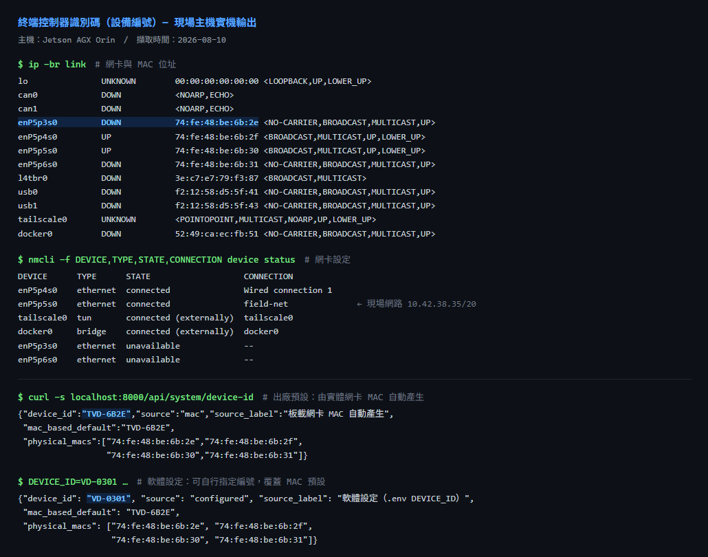

# 識別碼設定（設備編號）— 規範 (C)

## 規範條文

> (C) 識別碼設定
> 每一個終端控制器須具有個別之通訊識別碼（設備編號）設定，
> 指撥開關（DIP SWITCH）16 位元**或以軟體控制**。

本系統採後者 —— **以軟體控制**。

---

## 做法

設備編號由兩層決定，上層優先：

| 優先序 | 來源 | 說明 |
|---|---|---|
| 1 | `.env` 的 `DEVICE_ID` | 由人指定，等同 DIP 開關轉出來的值 |
| 2 | 板載網卡 MAC 自動產生 | 未指定時的出廠預設，開箱即唯一 |

自動值取實體網卡 MAC 的**末 2 bytes（= 16 位元）**，格式 `TVD-XXXX`，
與規範所述 16 位元 DIP 開關的編碼空間（0 ~ 65535）相同。

現場這台的實體網卡 MAC 為 `74:fe:48:be:6b:2e`，
取末 2 bytes → 編號 **`TVD-6B2E`**。

---

## 實機畫面



上圖為現場主機（Jetson AGX Orin）的實際指令輸出，四段依序是：

1. `ip -br link` —— 網卡與 MAC 位址，板載四孔為 `74:fe:48:be:6b:2e` ~ `:31`
2. `nmcli device status` —— 網卡設定，現場網路走 `enP5p5s0`（`field-net`，10.42.38.35/20）
3. `curl /api/system/device-id` —— 出廠預設，編號 `TVD-6B2E`，來源標示 `mac`
4. 指定 `DEVICE_ID=VD-0301` —— 編號改為 `VD-0301`，來源標示 `configured`

第 3、4 段即證明「可設定」與「未設定時自動唯一」兩種行為都成立。

---

## MAC 的挑選規則

一台機器上有很多網路介面，不是每個都能拿來當編號。實際挑選只認**實體網卡**，
並排除「本地管理位址」（MAC 第一個 byte 的 bit1 = 1，代表軟體自行產生）：

| 介面 | MAC | 採用 | 原因 |
|---|---|---|---|
| `enP5p3s0` ~ `enP5p6s0` | `74:fe:48:be:6b:2e` ~ `:31` | ✅ | 板載實體網卡，永久位址 |
| `usb0` / `usb1` | `f2:12:58:...` | ❌ | USB gadget，每次開機隨機產生 |
| `docker0` | `52:49:ca:...` | ❌ | 虛擬橋接 |
| `l4tbr0` | `3e:c7:e7:...` | ❌ | 虛擬橋接 |
| `tailscale0` / `lo` | 無 | ❌ | 無實體位址 |

在四個合格的 MAC 中取**最小值**，因此編號與「哪一孔有接線、接哪一孔」無關 ——
拔插網線、改接網孔都不會換編號。

---

## 兩種常見情況

**要指定編號（例如交控中心統一編碼）**

編輯 `.env`：

```
DEVICE_ID=VD-0301
```

重啟服務後 `/api/system/device-id` 與所有對外 API 的 `meta.device_id` 都會改為 `VD-0301`。

**主機板送修更換**

MAC 會跟著換，自動編號也會變。把原本的編號填進 `.env` 的 `DEVICE_ID` 即可，
交控中心端的歷史資料不會斷。

---

## 編號會出現在哪裡

- `GET /api/system/device-id` —— 查詢編號與來源
- 對外 API（`/api/v1/external/*`）每筆回應的 `meta.device_id`
- 網頁「系統資訊」卡片，同時顯示編號與板載網卡 MAC
