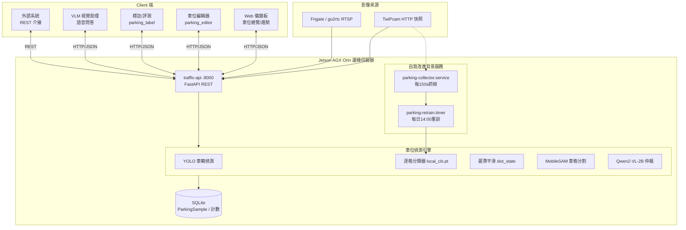

# 停車場車位自動化管理系統 — Client / Server 架構（Jetson 邊緣運算）

> 以 NVIDIA Jetson AGX Orin 為邊緣伺服器的停車場車位自動化管理系統。
> Client（瀏覽器/外部系統）↔ Server（Jetson）採 REST / HTTP 通訊。
> 各端點對照實際程式碼 `api/routes/parking.py`。製作日期：2026-06-18

---

## 一、系統定位

單台 **Jetson 邊緣伺服器**即可完成「**車位偵測 → 佔用判定 → 進出計數 → 自我學習 → 對外服務**」的全自動停車場管理，無需雲端、低延遲、資料留在邊緣。

**自動化三層**：
1. **感知自動化** — YOLO 逐格偵測 + 遲滯平滑，自動判空位/佔用
2. **決策自動化** — 交叉校正 + VLM 自動仲裁可疑車位
3. **學習自動化** — 自動收集畫面 → 自動標註 → 自動訓練 → 品質閘門 → 自動部署（無人工）

---

## 二、功能簡介

本系統以**一台 Jetson 邊緣伺服器**，提供停車場「**看得到、算得準、自己學**」的全自動車位管理：

| # | 功能 | 一句話效益 |
|---|------|-----------|
| 1 | 即時車位偵測 | 逐格判定空位/佔用，遲滯平滑去抖動，現場狀況一目了然 |
| 2 | 空位數即時統計 | 自動彙整總車位／佔用／可用數與佔用率 |
| 3 | 進出車輛計數 | 計數線跨越 + 方向判定，掌握在場車數與進出流量 |
| 4 | AI 逐格辨識 | 本地 fine-tune 分類器補傳統偵測漏抓的車，低解析也準 |
| 5 | VLM 智慧仲裁 | 可疑車位由視覺語言模型自動複判，減少誤判 |
| 6 | 自我學習（越用越準） | 自動收集→標註→訓練→品質閘門→自動上線，**無需人工標註** |
| 7 | 快速車位建置 | 編輯器支援拖框、Grid 透視一鍵生成、SAM 點選車格 |
| 8 | 視覺語音助理 | 對任一畫面語音/文字問「現在幾個空位」即時回答 |
| 9 | 數據儀錶板 | 佔用率、24h 趨勢、交叉校正趨勢視覺化 |
| 10 | 邊緣自主運算 | 單機完成全流程，低延遲、無雲端依賴、資料留現場 |

> **一句話定位**：把「需要人盯著看、定期人工校正」的停車場監看，變成「**自己偵測、自己仲裁、自己學習進化**」的邊緣 AI 系統。

---

## 三、Client-Server 架構圖



---

## 四、Server 端組件（Jetson）

| 組件 | 角色 | 程式碼 |
|------|------|--------|
| `traffic-api` :8000 | FastAPI，對外唯一 REST 入口 | `api/routes/parking.py` |
| 車位佔用引擎 | YOLO 車輛中心落格內 / IoU 加權判佔用（門檻 0.5） | `services/parking_occupancy.py` |
| 逐格分類器（P4） | 本地 fine-tune `local_cls.pt`，逐格判空/佔用，補 YOLO 漏抓 | `services/parking_slot_classifier.py` |
| 遲滯平滑 | 非對稱遲滯（空→占 2 frame、占→空 3 frame）去抖 | `services/parking_slot_state.py` |
| MobileSAM 分割 | 點選車格自動框（懶載入，編輯時才用） | `services/parking_sam.py` |
| VLM 仲裁 | 交叉校正差距大時 Qwen2-VL-2B 仲裁 | `services/parking_vlm.py` |
| 進出計數 | 計數線跨越 + 方向判定 | `services/parking_counter.py` |
| 資料層 | SQLite：佔用樣本、計數、24h 歷史 | `data/violations.db` |

**背景自我改進服務（systemd）**：
- `parking-collector.service` — 每 150s 抓 TwiPcam 快照，滾動保留 800 張多時段素材
- `parking-retrain.timer` — 每日 14:00：自動標註（yolo11m）→ 訓練分類器 → **品質閘門** → 通過才部署+重啟，否則回滾

---

## 五、Client 端組件

| Client | 功能 | 通訊 |
|--------|------|------|
| Web 儀錶板（Vue SPA） | 車位總覽、佔用率、24h 趨勢、交叉校正趨勢 | 輪詢 `/api/parking/occupancy`、`/history` |
| 車位編輯器 `parking_editor.html` | 拖框 / Grid 透視 / **SAM 點選** / 整排調整 / 區域遮罩 / 計數線 | `/slots/save`、`/slots/auto`、`/slots/sam_point`、`/mask/save` |
| 標註評測 `parking_label.html` | 逐格紅綠標註、算準確率、產訓練裁切 | `/label/save`、`/label/metrics` |
| VLM 視覺助理 | 任一畫面語音/文字問答、車位狀況查詢 | `/vlm/chat`、`/vlm/load` |
| 外部系統 | 車位數據介接（看板/導引/收費） | REST GET `/occupancy`、`/counting/status` |

---

## 六、核心資料流

### (1) 即時佔用判定
```
攝影機快照 → fetch_frame → YOLO 車輛偵測
   → 逐格：中心落格內? / 分類器判佔用? → 遲滯平滑
   → 佔用/空位 → 寫 ParkingSample → Client 輪詢取得
```

### (2) 自動仲裁（決策自動化）
```
區域內車數 vs 車位佔用數差距 ≥ 閾值
   → 升級 VLM 仲裁該畫面 → 修正佔用判定
```

### (3) 自我改進（學習自動化）
```
collector 累積多時段畫面
   → yolo11m 強模型自動標註（時序穩定 + 模糊跳過）
   → 訓練逐格分類器 → 品質閘門（防退化）
   → 通過 → 部署 local_cls.pt + 重啟 → Server 自動載入新模型
```

---

## 七、REST API 介面（實際端點）

| Method | 端點 | 功能 |
|--------|------|------|
| GET | `/api/parking/occupancy` | 車位佔用即時結果（總數/佔用/空位/逐格） |
| GET | `/api/parking/sources` | 車位來源清單 |
| GET | `/api/parking/snapshot/raw` | 原始畫面快照 |
| GET | `/api/parking/stream` | 佔用視覺化 MJPEG 串流 |
| GET | `/api/parking/history` | 24h 佔用歷史 |
| GET | `/api/parking/counting/status` | 進出計數狀態 |
| POST | `/api/parking/slots/save` | 儲存車格定義 |
| POST | `/api/parking/slots/auto` | YOLO/PKLot 自動偵測車格 |
| POST | `/api/parking/slots/sam_point` | **MobileSAM 點選分割車格** |
| POST | `/api/parking/mask/save`・`/exclusion_mask/save`・`/counting_line/save` | 區域/不偵測區/計數線 |
| POST | `/api/parking/vlm/chat` | VLM 視覺問答 |
| POST | `/api/parking/label/save` ・ GET `/label/metrics` | 標註 + 準確率評測 |

---

## 八、自動化管理能力（簡報主打）

| 能力 | 說明 |
|------|------|
| 自動空位偵測 | 逐格佔用/空位即時判定，遲滯去抖 |
| 自動進出計數 | 計數線跨越 + 方向，即時在場車數 |
| 自動仲裁 | 可疑車位 VLM 自動複判，免人工 |
| **自我學習** | 自動收集 → 標註 → 訓練 → 閘門 → 部署，模型隨場景越用越準 |
| 自動部署 | `git push` → CI 驗證 → 自動上線（2 分鐘） |
| 邊緣自主 | 單台 Jetson 完成全流程，無雲端依賴、資料留邊緣 |

---

## 九、部署與維運

| 項目 | 內容 |
|------|------|
| 自動部署 | GitHub Actions self-hosted runner（Jetson）→ 15 項驗證 → 自動 `git pull` + `systemctl restart` |
| systemd 服務 | traffic-api（API+偵測）、parking-collector（抓幀）、parking-retrain（重訓 timer）、traffic-io（IO） |
| 模型儲存 | NVMe（`models/`，避免 eMMC 吃滿） |
| 時間同步 | systemd-timesyncd（Stratum 1），確保佔用樣本時間戳正確 |
| 穩定性 | 程序隔離（OCR/IO 獨立服務），近 24h 0 重啟 0 SEGV |

---

## 十、技術棧

- **邊緣硬體**：Jetson AGX Orin（JetPack 6 / CUDA 12.2 / TensorRT 8.6）
- **Server**：FastAPI、SQLAlchemy、SQLite、systemd 多服務
- **AI 模型**：YOLOv8n（偵測）、yolo11m（離線標註）、本地 yolov8n-cls（逐格分類）、MobileSAM（分割）、Qwen2-VL-2B（仲裁）
- **Client**：Vue 3 SPA、Element Plus、Chart.js、Web Speech API（語音）
- **通訊**：REST / HTTP-JSON、MJPEG 串流
- **影像來源**：TwiPcam HTTP 快照、Frigate + go2rtc

---

*本架構文件對照實際程式碼產出，可作為簡報「停車場車位自動化管理系統」章節骨架。*
